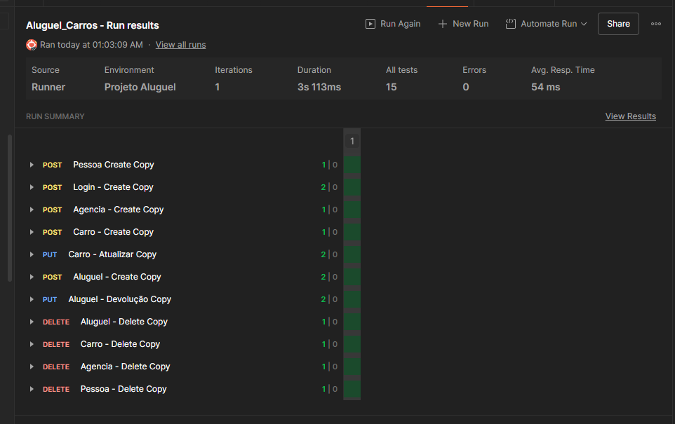

# API de Locação de Veículos

Este projeto consiste em uma API RESTful desenvolvida para a disciplina de Serviços Web, simulando o backend de um sistema de locação de veículos. A aplicação gerencia o fluxo completo de aluguel, desde a autenticação do usuário até a devolução do automóvel.

## Recursos

* **Pessoa**: Quem aluga o carro. Possui credenciais de identificação.
* **Agência**: Representa o local onde os veículos estão alocados e podem ser devolvidos.
* **Carro**: Veículo que será alugado.
* **Aluguel**: Armazena o histórico e estado atual das locações. 
* **Login**: Responsável pela autenticação que permite acesso às rotas protegidas. 

## Relacionamentos 

* **Agência (1:N) Carro**: Cada veículo pertence obrigatoriamente a uma agência específica.
* **Pessoa (1:N) Aluguel**: Um cliente pode ter um histórico de vários aluguéis.
* **Carro (1:N) Aluguel**: Pode estar relacionado a apenas um aluguel ativo por vez.
* **Agência (1:N) Aluguel**: Vincula retirada ou devolução de carros a apenas uma agência.

## Ferramentas Utilizadas

* **Node.js & Express:** Ambiente de execução e framework para a construção da API e gerenciamento de rotas.
* **PostgreSQL:** Banco de dados relacional para persistência de dados.
* **Sequelize:** ORM (Object-Relational Mapping) para abstração das consultas SQL e gestão de modelos.
* **JWT (JSON Web Token):** Mecanismo de autenticação stateless para proteção de rotas sensíveis.
* **Swagger (OpenAPI):** Geração automática de documentação e interface de testes das rotas.
* **Dotenv:** Gerenciamento de variáveis de ambiente (segurança de chaves e portas).

## Como executar

1. Na pasta do projeto no Visual Studio Code, execute no terminal:

``` npm install ```

2. Crie um arquivo .env na raiz do projeto com suas credenciais:

``` PORT=3000
DB_NAME=locadora_db
DB_USER=postgres
DB_PASS=sua_senha
DB_HOST=localhost
JWT_SECRET=sua_chave_secreta 
```
3. Criar o banco de dados na máquina local com o mesmo nome que foi definido na variável DB_NAME.

4. Para iniciar o servidor, criar as tabelas automaticamente e gerar documentação, execute o comando:

``` npm run dev ```

## Documentação da API

Disponível em:

http://localhost:3000/docs

## Testes das rotas - Postman

1. No Postman, importe o arquivo `Aluguel_Carros.postman_collection.json`.
2. Clique em Environments (menu lateral esquerdo) e crie um novo ambiente chamado "Locadora"
3. Crie uma variável global para armazenar a url base:
``` baseUrl = [http//localhost/3000/api](http://localhost:3000/api) ```
4. Crie as seguintes variáveis sem atribuir valor inicial:
``` token, pessoa_id, agencia_id, carro_id, aluguel_id, email, senha ``` 

Cada requisição possui um script na aba Post-response, que gerencia o fluxo de testes. Para executar os testes:

1. Certifique-se de que o ambiente Locadora está selecionado.
2. Selecione a pasta "Fluxo"
3. Clique no botão Run.

